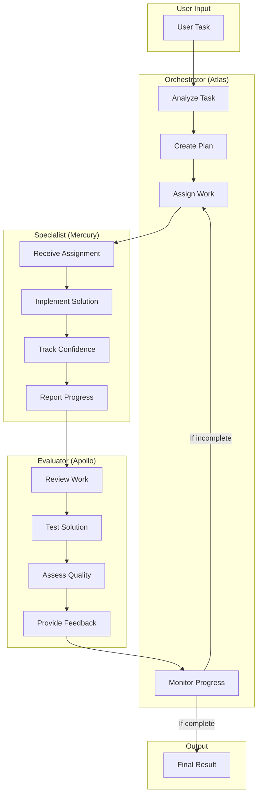
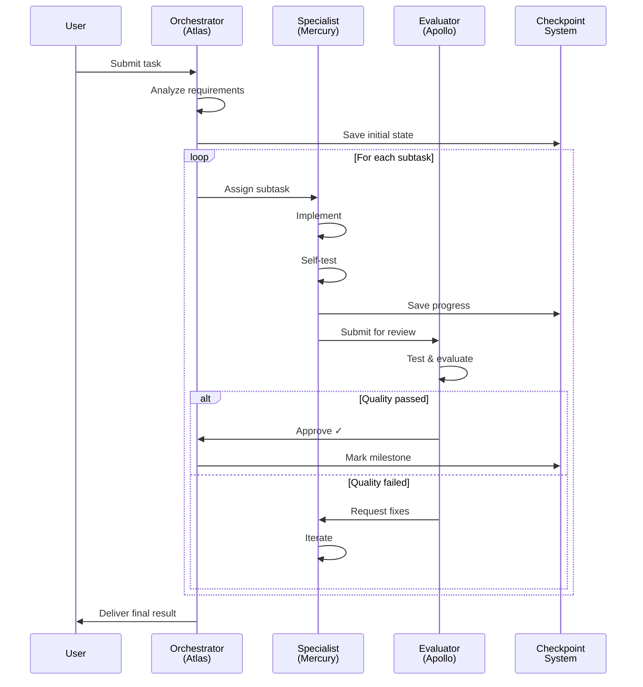
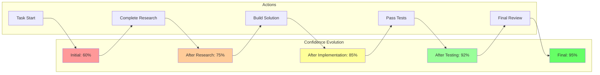
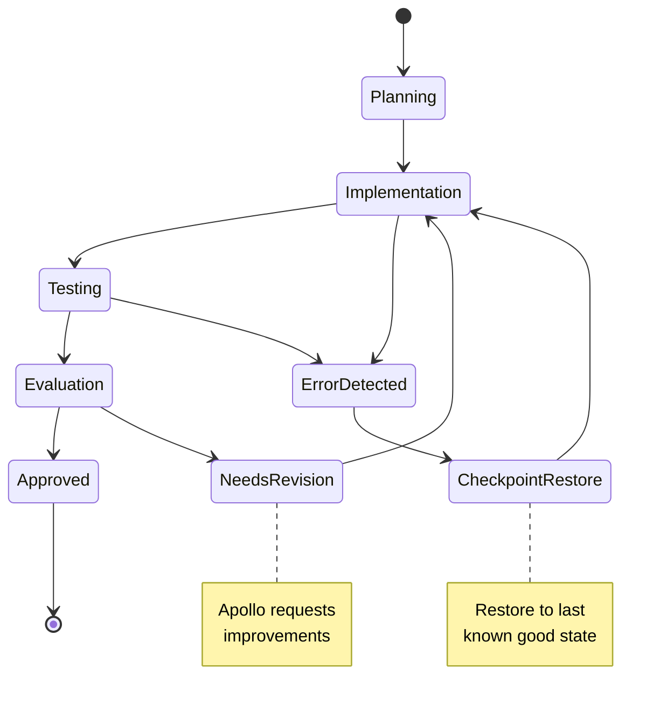
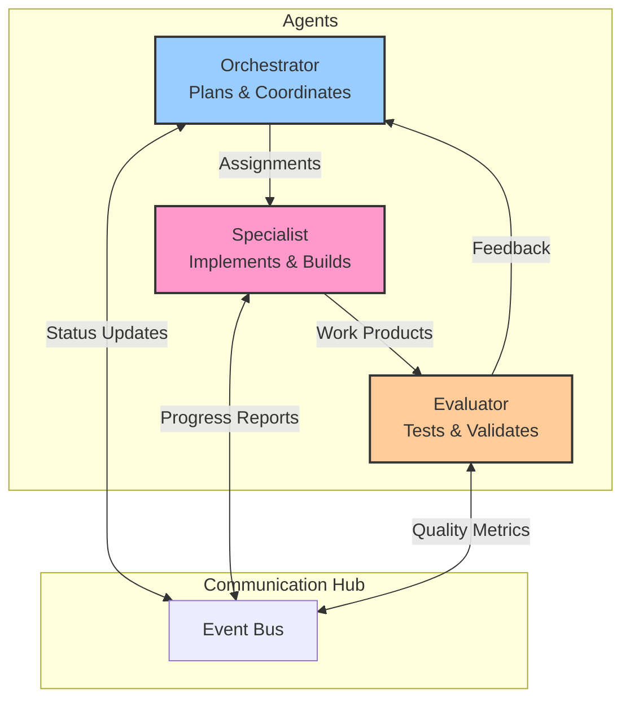
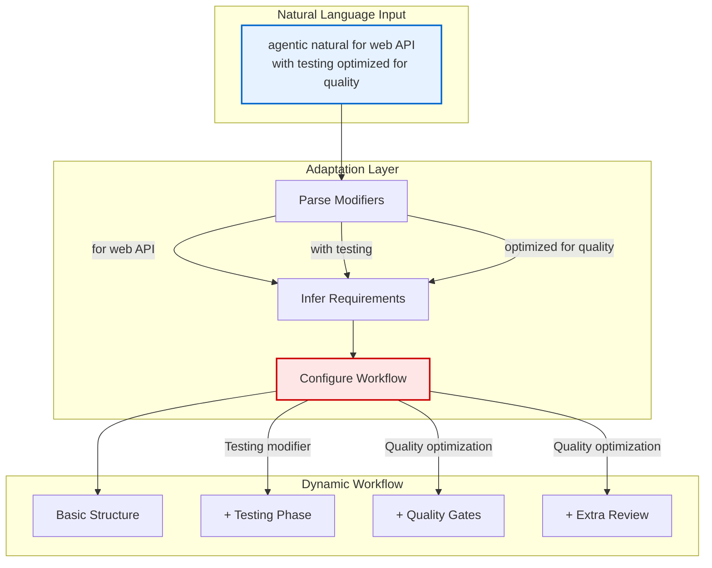
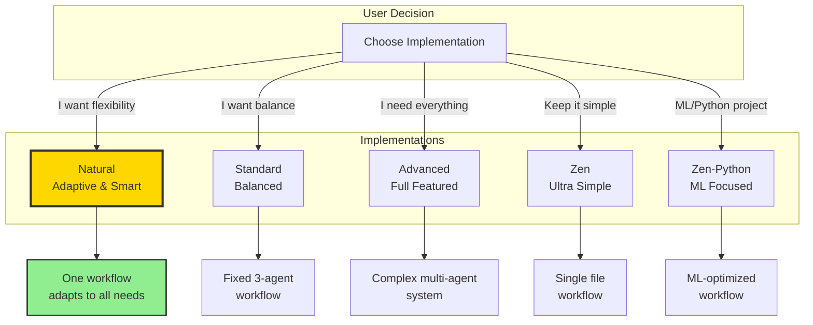
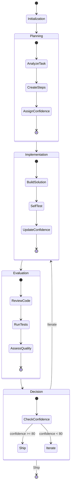
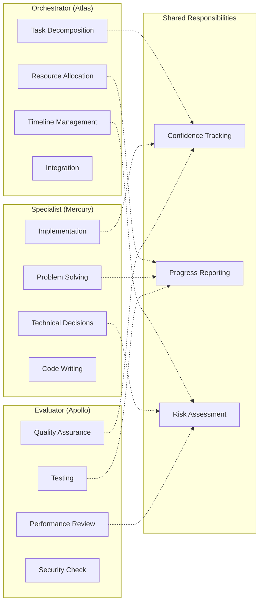

# Agent Interaction Flow Diagrams

Visual representations of how the three agents (Orchestrator/Atlas, Specialist/Mercury, and Evaluator/Apollo) interact in the Agentic Workflow system.

## Basic Agent Interaction Flow

## Detailed Workflow with Checkpointing

## Confidence Tracking Flow

## Error Recovery Flow

## Multi-Agent Communication Pattern

## Agentic Natural Adaptive Flow

## Implementation Comparison Flow

## Workflow State Machine

## Agent Responsibility Matrix

## Rendering These Diagrams

These diagrams use Mermaid syntax and can be rendered in:
- GitHub markdown files (automatic rendering)
- VS Code with Mermaid preview extensions
- Online at [mermaid.live](https://mermaid.live)
- Any markdown viewer that supports Mermaid

To use in other tools, copy the mermaid code blocks and paste into any Mermaid-compatible renderer.